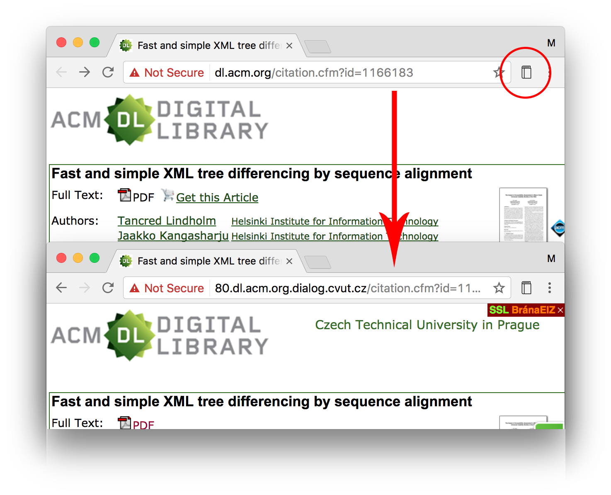

ČVUT EIZ Proxy
==============

Reloads articles hidden behind paywall in ČVUT EIZ Proxy.

Issues
------

- Invoking redirect without being logged-into EIZ shows the EIZ login page, but doesn't store the request and open the target paper after logging in.

Usage example
-------------

